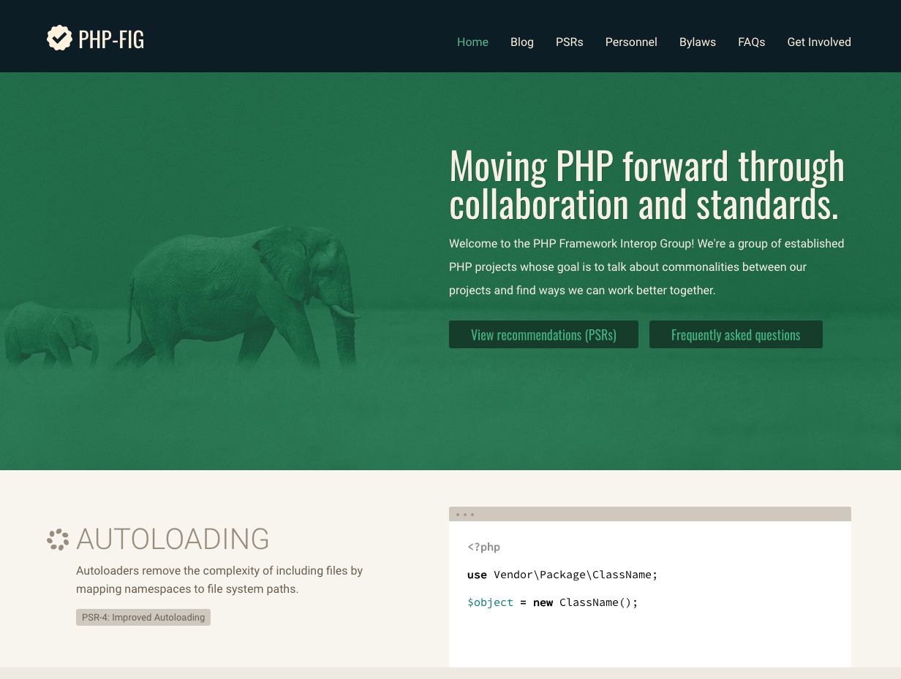
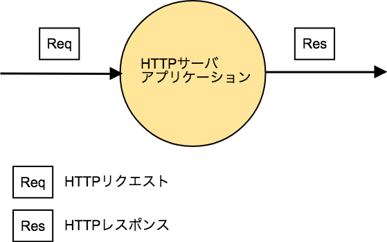
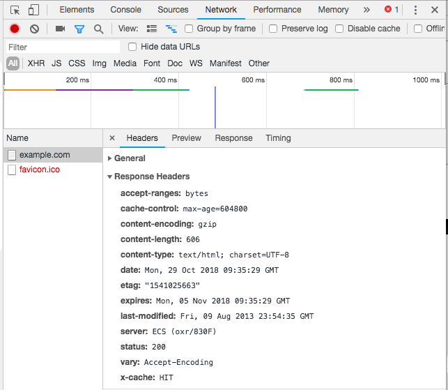
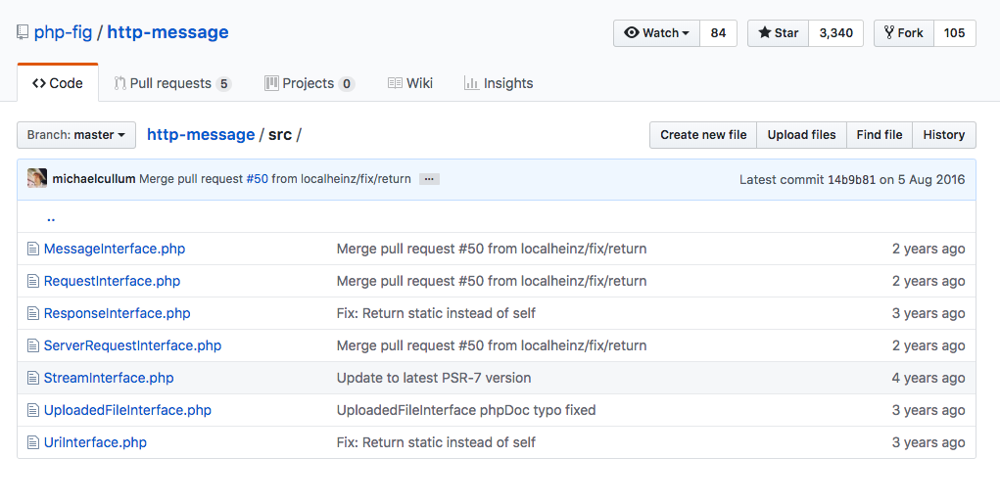
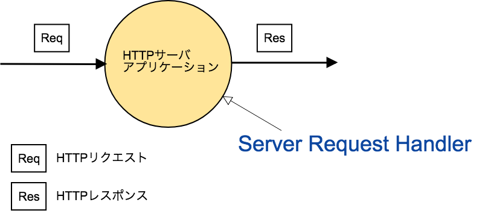
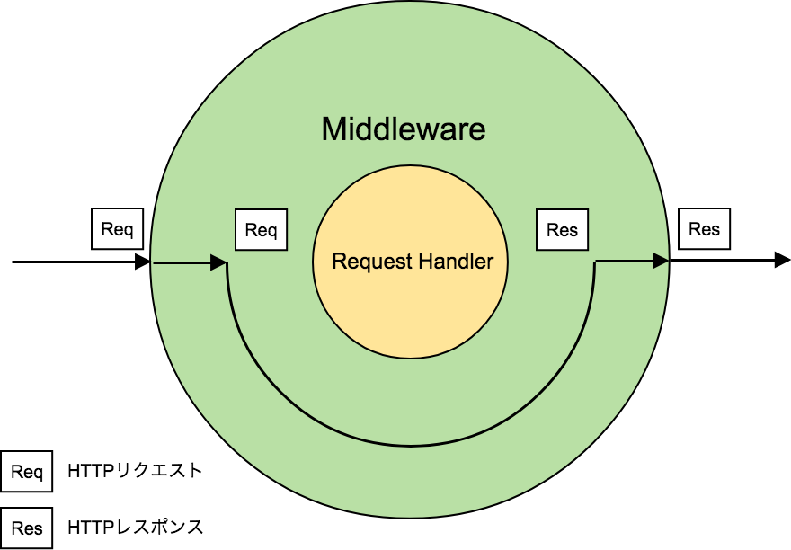
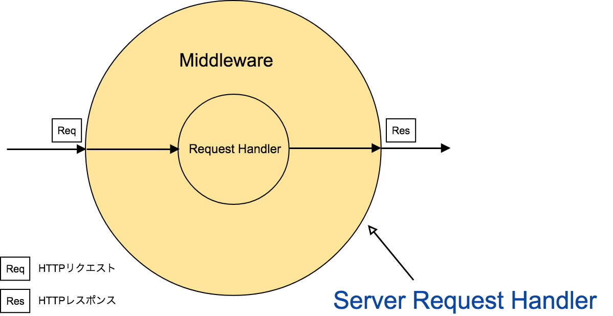
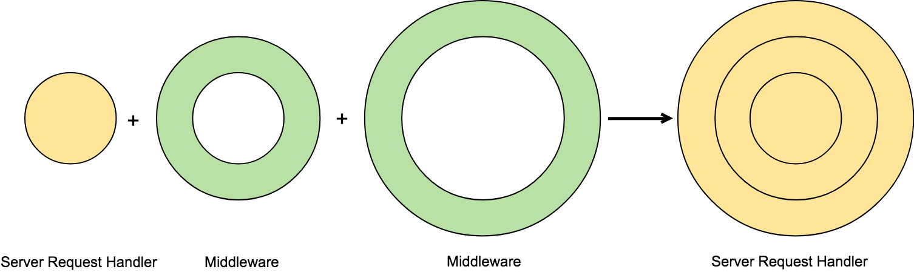
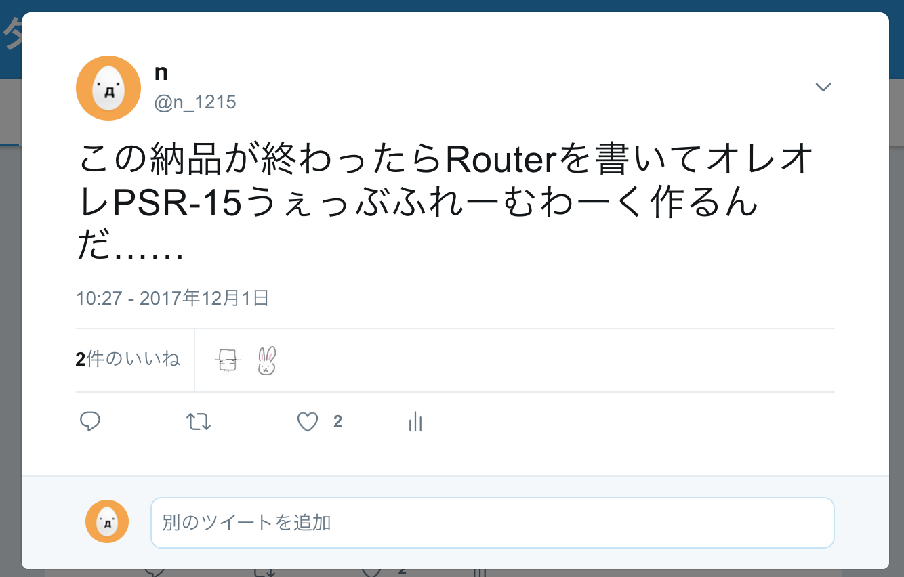

### For PHP Meetup Osaka 2018.10

## PSR-15 Request Handlerから理解するMiddlewareの仕組み

### 2018/10/30 株式会社 Nextat 中榮健二


---


## 自己紹介

* 中榮健二 （なかえけんじ）
* [株式会社Nextat](https://nextat.co.jp/) 取締役
* twitter: [@n_1215](https://twitter.com/n_1215)
* 普段はLaravelを使ったソシャゲ開発などをやっています
* [baserCMS](https://basercms.net/) コアコミッター
* 最近[ext-async](https://github.com/concurrent-php/ext-async)が気になる

---

今日は

## PSR-15 HTTP Server Request Handlers

の話をします。

### 内容
1. PSR の話
2. PSR-7 HTTP Message の話
3. PSR-15 HTTP Server Request Handlers の話
4. PSR-15 HTTP Server Middleware の話
5. PSR-15の議論の歴史 の話

---

## 1. PSRの話

---

## PSR
* PSR = PHP Standards Recommendations
* PHPを使う上でオススメの規約やインターフェースの集まり
* "Standards"とあるがPHPの公式ではない

## PHP-FIG
* [PHP-FIG](https://www.php-fig.org/) = PHP Framework Interoperability Group
* PSRを作っているグループ
* PHP製のフレームワーク・CMS・ツールの開発者が集まっている
* 共通の規約や仕様を定めて相互運用性を高める目的

---


---

## PSRのメリット（個人の感想です）

* プロジェクトのコーディング規約を作るための雛形として有用
* 今後PSRに準拠するライブラリやFWが増えそうなので、ユーザーとして知っておいて損はない
* 自分で似たような仕組みを作るときにも参考になる
* PHP-FIGの[Google Group](https://groups.google.com/forum/#!forum/php-fig)の議論が興味深い

---
## PSRの分類
## (1) オートローディング
* PSR-4: Autoloader
  * 名前空間とディレクトリ構造を対応させる規約
  * Composerを使っていれば恩恵に預かっていることも多いはず

### Deprecated
* PSR-0: Autoloading Standard (Deprecated)
  * PSR-4の前身

---

## (2) コーディングスタイル
* PSR-1: Basic Coding Standard
* PSR-2: Coding Style Guide

### Draft
* PSR-5: PHPDoc Standard
  * PHPDocコメントの書き方の標準
* PSR-12: Extended Coding Style Guide
  * PSR-1/PSR-2でカバーしきれない最近のPHPの機能に対応
* PSR-19: PHPDoc tags
  * PSR-5の補完。タグの一覧を提供

---

## (3) インターフェース （今回は触れないもの）
* PSR-3: Logger Interface
* PSR-6: Caching Interface
* PSR-11: Container Interface
* PSR-13: Link definition interfaces
* PSR-16: Common Interface for Caching Libraries
* PSR-18: HTTP Client Interfaces

### Draft
* PSR-14: Event Dispatcher Interafaces

---

## (3) インターフェース （HTTP系/今回のお題）
* PSR-7: HTTP message Interfaces
* PSR-15: HTTP Server Request Handlers
* PSR-17: HTTP Factories


他のインターフェースは個々で完結しているものが多いが、この３つはシリーズ物

---

## 2. PSR-7 HTTP messageの話

---

### HTTPサーバアプリケーション



---

### HTTPサーバアプリケーション
入力：HTTPリクエスト

```
POST /path HTTP/1.1
Host: example.com

this=is&request=body
```

出力：HTTPレスポンス
```
HTTP/1.1 200 OK
Content-Type: text/plain

This is the response body
```

---
最近のブラウザは簡単にHTTPメッセージの中身が見られる



---

## PHPでのHTTPメッセージの処理
```
<?php
echo 'Hello ' . htmlspecialchars($_GET["name"]) . '!';
```
* スーパーグローバル($_GET, $_POST...)に入った値からHTTPリクエストの値が取れる
* echoやheader()関数でHTTPレスポンスを組み立てる
* HTTPに詳しくなくても使えてとてもお手軽
* グローバル変数……

---

## HTTPメッセージ実装乱立の時代
* HTTPリクエストとHTTPレスポンスのクラスを作って抽象化したい
* HTTPメッセージの実装がFW・プロジェクトごとに乱立していた

---

## PSR-7: HTTPメッセージの標準化



---


## PSR-7の特徴
* イミュータブルなオブジェクト (≒ 状態を変更するsetterを持たない)

```
$request = $request
    ->withMethod('GET')
    ->withUri(new Uri('https://example.com/'));
```

* bodyがStreamとして表現される

```
public function withBody(StreamInterface $body);
```

* HTTPクライアント側とHTTPサーバ側に両対応

```
interface ServerRequestInterface extends RequestInterface
```

---
## PSR-7の採用例

* Guzzle
* Slim3
* CakePHP3
* zend-expressive
* ReactPHP

---

## Symfony HTTP Foundation
* 一番勢力の強い[要出典] HTTPメッセージ実装
  * Symfonyのコンポーネント
  * Laravelなどで利用（illuminate/http）
* 今後はPSR-7と二分する感じになりそう？
* PSR-7互換のためのブリッジもある
  * https://symfony.com/doc/current/components/psr7.html
* 以降の話は、HTTP Foundationや他の実装に置き換えても事情は同じ

---

## 3. PSR-15 HTTP Server Request Handlers の話

---

## HTTPサーバアプリケーション
* 入力：HTTPリクエスト
* 出力：HTTPレスポンス




---

## HTTPサーバアプリケーションの抽象化

```
interface RequestHandlerInterface
{
    public function handle(ServerRequestInterface $request): ResponseInterface;
}
```

利用

```
$request = new PSR7Request();
$handler = new MyRequestHandler();
$response = $handler->handle($request);
```
---
# なるほどいまいちわからん
---

## 身近な例
* Server Request Handler ≒ MVC FWのControllerのアクション

```
class MyController
{
    public function hello(ServerRequestInterface $request) : ResponseInterface
    {
        return new JsonResponse(['hello' => 'world']);
    }
}
```

---

* 実際はControllerのアクションは利便性重視な場合が多い

```
$router->get('/hello/{name}', 'MyController::hello');

class MyController
{
    public function hello(string $name): array
    {
        return ['hello' => $name];
    }
}

```

* (リクエスト →) ルートパラメータ → 配列 (→ JSONレスポンス)
* 暗黙的な変換でRequest Handler相当の処理が導出されている


---

## 4. PSR-15 HTTP Server Middleware の話

---

## HTTP Server Middleware

インターフェース

```
interface MiddlewareInterface
{
    public function process(
        ServerRequestInterface $request,
        RequestHandlerInterface $handler
    ): ResponseInterface;
}
```

* Request Handlerを横断する共通処理を行う


---

PSR-15より前の実装はこういうシグネチャが多かった

```
class MyMiddleware
{
    public function handle(
        Request $request,
        callable $next
    ): Response;
}
```

---

# なるほど全然わからん

---

## 具体例をそれっぽいコードで

---

### 1）メンテナンスモード

```
public function process(
    ServerRequestInterface $request,
    RequestHandlerInterface $handler
): ResponseInterface {
    // 前処理
    if ($this->isMaintenanceMode()) {
        return new Response('メンテナンス中です', 503);
    }

    return $handler->handle($request);    
}
```

---


### 2) レスポンスに共通ヘッダ付与

```
public function process(
    ServerRequestInterface $request,
    RequestHandlerInterface $handler
): ResponseInterface {
    $response = $handler->handle($request);
    // 後処理
    $modifiedResponse = $response
        ->withHeader('X-Powered-By: OreoreFramework/0.1')
        ->withHeader('X-XSS-Protection', '1; mode=block');
    return $modifiedResponse;
}
```

---

### 3) ベンチマーカー

```
public function process(
    ServerRequestInterface $request,
    RequestHandlerInterface $handler
): ResponseInterface {
    // 前処理
    $start = microtime(true);

    $response = $handler->handle($request);

    // 後処理
    $time = microtime(true) - $start;
    $ms = number_format($time * 1000, 1);
    $message = "processed in {$ms} ms.";       
    $this->logger->info($message);
       
    return $response;
}
```

---
### 他にもいろいろ
* 認証
* Cookie
* CSRFチェック
* 参考： [middlwares/psr15-middleares](https://github.com/middlewares/psr15-middlewares)

---

```
class MyMiddleware implements MiddlewareInterface
{
    public function process(
        SeverRequestInterface $request,
        RequestHandlerInterface $handler
    ): ResponseInterface {
        // 前処理
        // ...
        
        // ハンドラがリクエストを処理
        $response = $handler->handle($request);
        
        // 後処理
        // ...
                
        return $response;
    }
}

```

---
イメージ図


---
早期リターンの場合


---

## Interceptorパターン
* 処理が呼び出される前後に割り込み、制御を奪って別の処理を行うパターン
* https://en.wikipedia.org/wiki/Interceptor_pattern
* Aspected Oriented Programming
* MiddlewareはServer Request Handlerの処理に対して限定的なAOPの機能を提供

---

* 一般的なAOPで扱われる処理はより汎用的なもの
* 参考：[Ray.Aop](https://github.com/ray-di/Ray.Aop#interceptor) のメソッドインターセプター
```php
class MyInterceptor implements MethodInterceptor
{
    public function invoke(MethodInvocation $invocation)
    {
        // Before method invocation
        // ...

        // Method invocation
        $result = invocation->proceed();

        // After method invocation
        // ...

        return $result;
    }
}
```

---

よく似ている

```
class MyMiddleware implements MiddlewareInterface
{
    public function process(
        SeverRequestInterface $request,
        RequestHandlerInterface $handler
    ): ResponseInterface {
        // 前処理
        // ...

        // ハンドラがリクエストを処理
        $response = $handler->handle($request);

        // 後処理
        // ...

        return $response;
    }
}

```

---

## 入出力に注目する




---

## コード
Request Hadler + Middleware → Request Handler

```
class WrappedHandler implements RequestHandlerInterface
{
    public function __construct(
        MiddlewareInterface $middleware,
        RequestHandlerInterface $handler
    ) {
        $this->middleware = $middleware;
        $this->handler = $handler;
    }

    public function handle(
        ServerRequestInterface $request
    ): ResponseInterface {
        return $middleware->process($request, $this->handler);
    }
}

$newHandler = new WrappedHandler($middleware, $handler);
$response = $newHandler->handle($request);
```

---


## 合成が容易




Server Request Hadler + Middleware * N
→ Server Request Handler

Middlewareを複数追加できる玉ねぎ型の構造

---

## 注: クリーンアーキテクチャとは別です
図は玉ねぎ型ですが

---

## ここまでのまとめ
* HTTPサーバアプリケーションやControllerアクションの抽象がServer Request Handler
* MiddlewareはServer Request Handler限定のInterceptor
* Server Request Hadler と Middleware を組み合わせてServer Request Handlerを再構成できる
* Request Handlerに影響を与えずに複数の処理を追加できる

---

## 5. PSR-15の議論の歴史の話

---

## Middlewareありき
* ここまでの説明と、PSR-15の議論の経緯は逆になる
* もともとMiddlewareの互換性を目指してPSR-15が立ち上がった
* 各プロジェクトのMiddleware実装が先行していた
* Request Handlerという概念はまだ見出されていなかった

---

```
interface SinglePassMiddleware
{
    public function handle(
        Request $request,
        callable $next
    ): Response;
}

interface DoublePassMiddleware
{
    public function handle(
        Request $request,
        Response $response,
        callable $next
    ): Response;
}
```

* HTTPレスポンスを引数に取るシグネチャ＝ダブルパス方式
* PSR-15が採用したのはシングルパス方式
* PSR-15では、ファクトリを使うレスポンスの新規生成を推奨
  * → PSR-17 HTTP Factories
---


### Server Request Handlersという名付け

#### callableや\Closureの入出力の型がわかりづらい
  * callable $next → DelegateInterface $delegate
  * Delegateは処理を任せるものという意味合い
  * Middlewareを第一に考えた命名

#### そもそもDelegateInterfaceの命名が悪い？
  * MiddlewareがなくてもDelegateだけを扱える
  * 単体でも存在できるのにDelegateという名はふさわしくない
  * DelegateがなければMiddlewareは存在しない
  * 主従が逆では？
  * → \Psr\Http\Server\RequestHandlerInterface $handler
---

## パッケージが２つに分割された

* psr/http-server-handler
* psr/http-server-middleware

### 依存関係
* psr/http-server-handlerはpsr/http-messageに依存
* psr/http-server-middlewareはpsr/http-server-handlerに依存

---
# タイトルも変更

## PSR-15 HTTP Middleware
　 ↓
## PSR-15 Server Request Handlers

## 🎉 


---
## おまけ: PSR-15 フレームワークを作ろう

* Middleware / Request Handler Dispatcher
  * MiddlewareとRequest Handlerを組み合わせてRequest Handlerを作る
* Router
  * Requestの内容に応じたRequest Handlerを呼び出す
* DI Container
  * Request Handlerの組み立て補助

* どれも既存の実装があるので、組み合わせるだけでも可
* 特にMiddleware Dispatcherを一度作ればPSR-15が理解できる

---



---

→ 簡単なの作った。
https://github.com/n1215/tsukuyomi
https://github.com/n1215/jugoya (Middlewareディスパッチャ)

---

## まとめ
* PSR-15の歴史はMiddlewareの話から始まった
* PSR-15の真の主役 Server Request Handlerは遅れて登場した
* 新規向けにはServer Request Handlerからのほうが理解しやすい
* 実用上はMiddlewareとServer Request Handlerの合成がキモ
* PSR-15フレームワークを作るのは楽しいですよ

---
## ご静聴ありがとうございました
* ご質問があればどうぞ


### PR
* 毎週水曜18:30〜 京都でもくもく会を開催中
* https://nextat.connpass.com/
